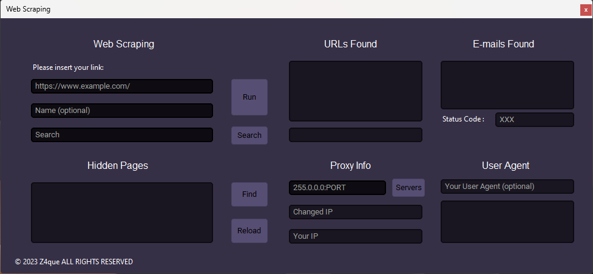

# Scooby

<p align = "left">
  
</p>

This **Web Scraper GUI Application** provides an intuitive and user-friendly interface for scraping web pages, extracting data, and managing scraped content. The application is built using **Python**, with a focus on modularity and efficiency, utilizing libraries such as **BeautifulSoup**, **requests**, and **customtkinter**.

### 🌐 **Web Scraping**
- Extract media files (images, videos, audios) and scripts.
- Download hyperlinks and save them into organized directories.
- Detect hidden pages and subdirectories using multithreading for faster results.
- Search for email addresses using **regex** on the scraped content.

### 🛠️ **Customization Options**
- Set a custom **User-Agent** or randomly pick one from a predefined list.
- Optionally configure a proxy server to anonymize scraping.

## Installation

- Clone this repository:
    ```bash
    git clone https://github.com/Zaque-69/Scooby-main.git
    cd Scooby-main
    ```
- Install the required Python dependencies:
    ```bash
    pip install -r requirements.txt
    ```

## Usage

- Run the application:
    ```bash
    python main.py
    ```

- Enter the URL to scrape and configure your options using the GUI.
- Start the scraping process and manage the extracted data.


## Requirements

- Python 3.11 or later
- Libraries:
  - BeautifulSoup4
  - requests
  - customtkinter

## License

This project is licensed under the MIT License. See the LICENSE file for details.
